  <picture>
    <source media="(prefers-color-scheme: dark)" srcset="./dark.svg">
    <source media="(prefers-color-scheme: light)" srcset="./light.svg">
    
  </picture>

<h3 align="center">
AI & ML Enthusiast • Deep Learning Developer • Computer Vision Learner
</h3>

🎓 B.Tech CSE Student at UCET, Vinoba Bhave University

📍 Jharkhand, India • 🚀 Building AI-Powered Applications

<a href="https://github.com/justunforgettable">GitHub</a> •
<a href="www.linkedin.com/in/nahid-kausar-3594b7295">LinkedIn</a> •
<a href="mailto:nahid.kausar138@gmail.com">Email</a>

## 🛠️ Tech Stack

 

## 📌 Featured Projects
<!-- Your pinned repositories will appear right below -->
- 🎓 B.Tech CSE Student
- 🤖 Interested in Machine Learning, Deep Learning and Computer Vision
- 🌱 Currently learning Generative AI and Advanced Deep Learning
- 💡 Building AI-powered applications using Python and TensorFlow
- 📫 Reach me: nahid.kausar138@gmail.com

---

## 🛠️ Technology Stack

### 🤖 Machine Learning & Deep Learning
- Python
- TensorFlow
- Keras
- NumPy
- Pandas
- OpenCV
- Scikit-learn
- Matplotlib
- Pillow (PIL)

### 🌐 Frontend & Web Application
- Streamlit
- HTML5
- CSS3
- JavaScript

### 📊 Data Handling & Visualization
- Pandas
- NumPy
- Matplotlib
- Seaborn

### 🔧 Development Tools
- Google Colab
- Jupyter Notebook
- Git
- GitHub
- VS Code

---

## 📈 Current Focus

Deep Learning • Computer Vision • Generative AI

---

⭐ From [justunforgettable](https://github.com/justunforgettable)
